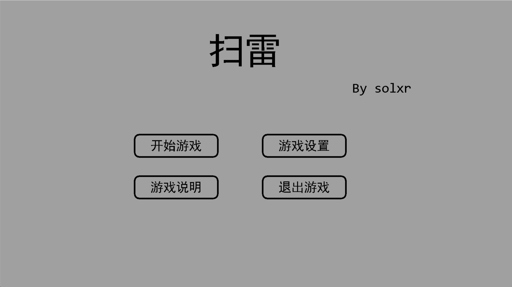
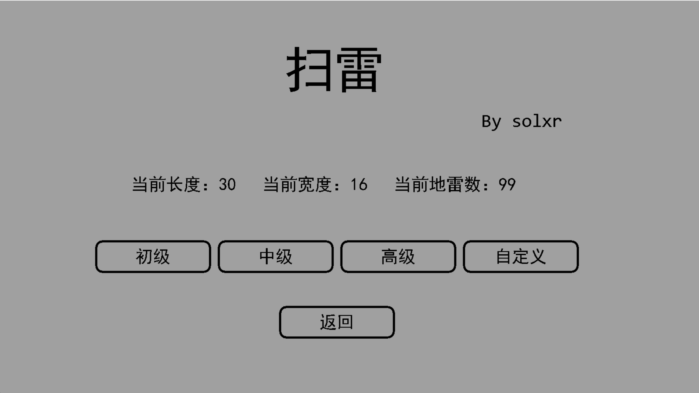
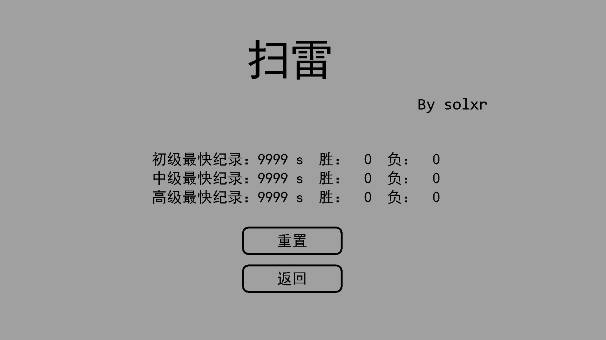
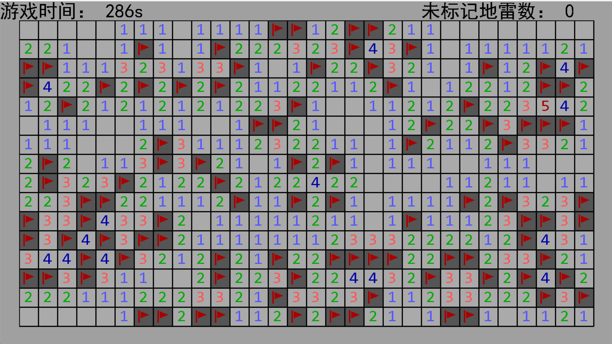

# EasyX环境下实现扫雷
## 前言
### 开发工具
**Visual Studio 2022**  
**EasyX_202440601**

### 开发语言
C++

### 参考资料
> EasyX官方中文教程： https://docs.easyx.cn/zh-cn/intro

### 项目截图

### 使用说明
#### 进入游戏方法
点击`Minesweeper`应用程序即可开始游玩。  
里面有进一步的游戏帮助。

#### 游玩须知
1. 不要删掉`diff.txt` `Tbest.txt` `rate.txt`。原因同第一条。
2. 如果发现计时器不动了，移动鼠标即可恢复。
3. 该游戏没有设置保护机制，所以你第一下就有可能点到雷而失败。

### 查看源代码
1. 源代码在名为“源代码”的文件夹中，打开文件夹后点击`Minesweeper.sln`打开`Visual Studio`解决方案，即可查看所有头文件和源文件。
2. 或者也可以点击“源代码”里的`Minesweeper`文件夹查看。
3. 如果你在解决方案内直接运行，统计数据可能会出错，原因是两个应用程序读取的不是同一个文本文件。
4. 内置外挂：打开`initGame.cpp`，然后取消掉调试下方代码的注释，并重新编译运行，这时候就会产生一个自带透视的应用程序（在`x64\Debug`中），开始游戏后可以在终端查看所有地块的状态。